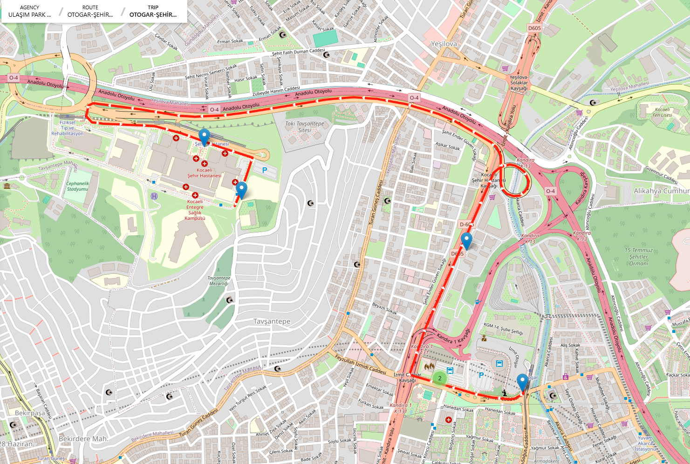
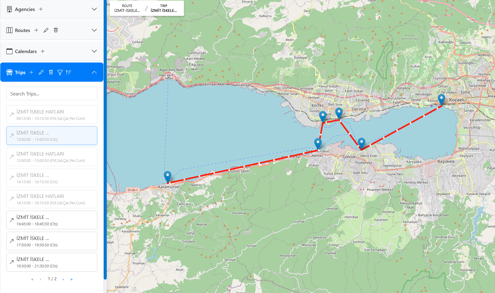
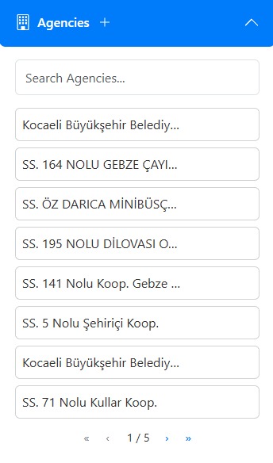
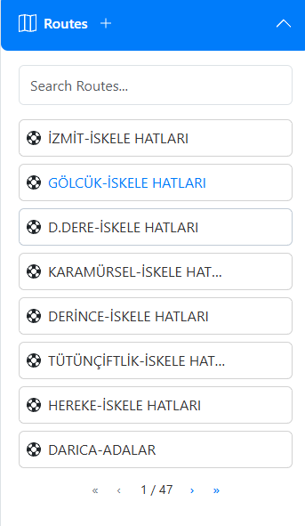
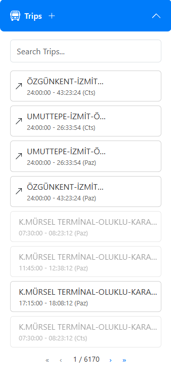
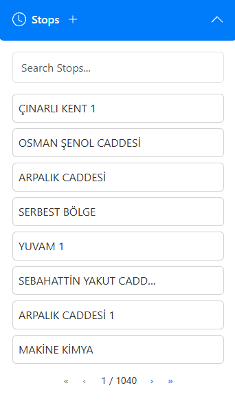
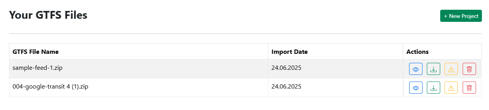
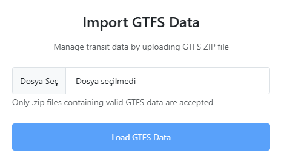

# 🚌 GTFS-Editor

> **GTFS (General Transit Feed Specification)** standardına uygun, gelişmiş bir veri yönetimi ve ücret hesaplama uygulaması.

GTFS-Editor, toplu taşıma sistemlerine ait veri setlerinin yönetilmesini ve GTFS-Fare V2 standardı kapsamında rota bazlı ücretlendirme yapılmasını sağlayan tam özellikli bir platformdur. Kullanıcılar kendi GTFS veri setlerini içe/dışa aktarabilir, düzenleyebilir ve farklı kullanıcı kategorileri için esnek ücret kuralları tanımlayabilir.

---

## 🚀 Özellikler

- ✅ Kullanıcı tabanlı kimlik doğrulama (JWT)
- 📥 GTFS veri seti içe aktarma (agency, routes, trips, stops, shapes, calendar, stoptimes)
- 📤 GTFS veri seti dışa aktarma
- 💳 GTFS-Fare V2 uyumlu ücret yapısı:
  - Fare Products (Ücret ürünleri)
  - Fare Media (Bilet/kart türleri)
  - Rider Categories (Öğrenci, tam, yaşlı vb.)
  - Fare Leg Rules (Sabit ve mesafeye dayalı ücretlendirme)
  - Fare Transfer Rules (Aktarma kuralları)
- 📊 Rota bazlı ücret hesaplama
- 🖉 Harita üzerinden **"Edit Mode"** erişimi: Durak ve rota çizgileri ekleyip düzenleyebilme
- 🗂️ MySQL ile güçlü veri yönetimi
- 🧭 OSRM & OTP ile yön ve mesafe hesaplama desteği

---

## 🛠️ Kullanılan Teknolojiler (Technologies Used)

- **Backend:** Node.js, Express.js
- **Frontend:** React.js
- **Veritabanı (Database):** MySQL
- **Kimlik Doğrulama (Authentication):** JWT
- **Harita & Rotalama (Mapping and routing):** OSRM (Open Source Routing Machine), OTP (OpenTripPlanner)
- **Veri Standardı (Data Standard):** GTFS & GTFS-Fare V2

---

## 🌍 English Version

### 📌 Project Description

GTFS-Editor is a feature-rich platform that supports managing public transit data and applying route-based fare calculations in compliance with the **GTFS (General Transit Feed Specification)** and **GTFS-Fare V2** standards.

---

### 🚀 Features

- ✅ User authentication (JWT)
- 📥 GTFS data import (agency, routes, trips, stops, shapes, calendar, stoptimes)
- 📤 GTFS data export
- 💳 GTFS-Fare V2 compatible fare structure:
  - Fare Products (Products)
  - Fare Media (Tickets/cards)
  - Rider Categories (Student, full fare, senior, etc.)
  - Fare Leg Rules (Fixed or distance-based pricing)
  - Fare Transfer Rules (Free or time-limited transfers)
- 📊 Route-based fare calculation
- 🖉 Access to **Edit Mode** on the map: Add/edit stops and route paths interactively
- 🗂️ Robust data management with MySQL
- 🧭 Routing integration using OSRM & OTP

---

## 📸 Ekran Görüntüsü / Screenshots

